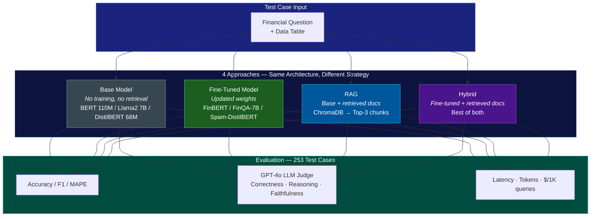
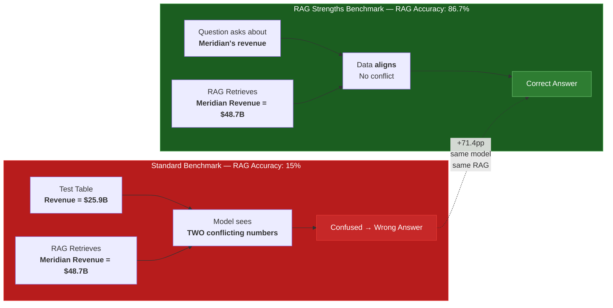
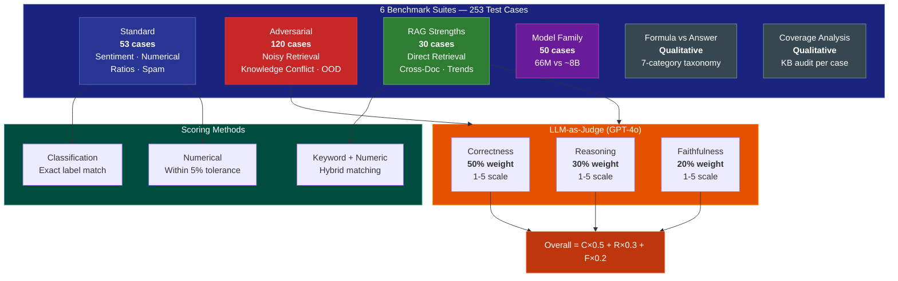
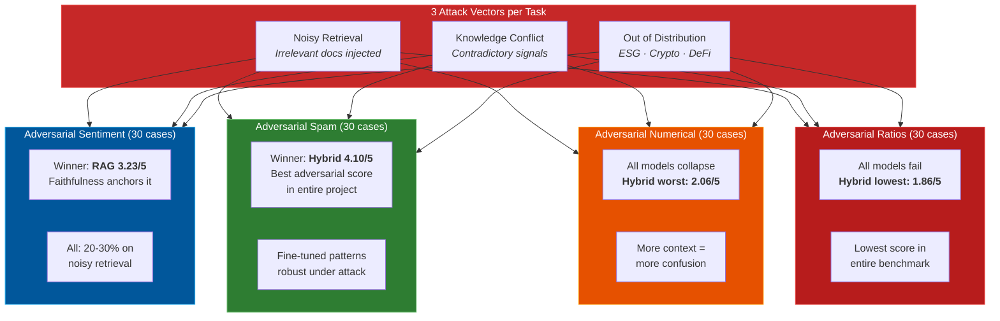
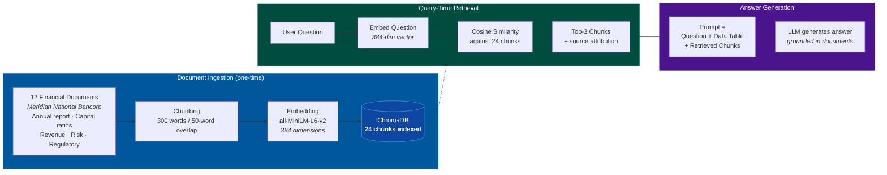
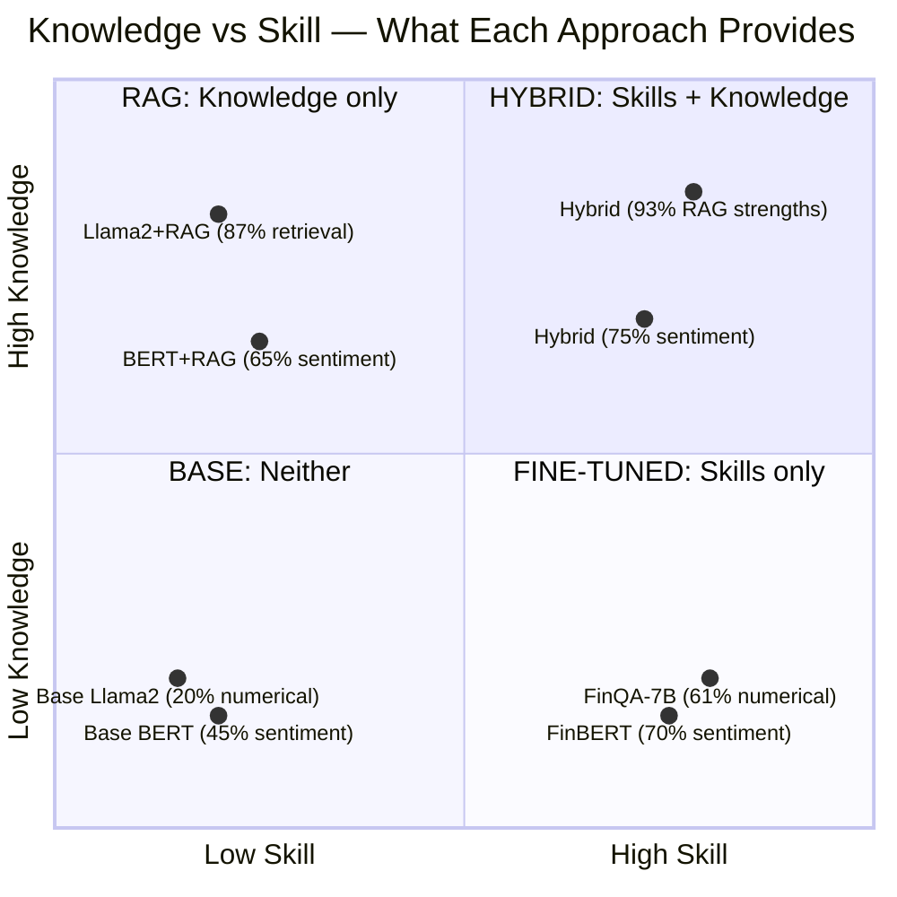
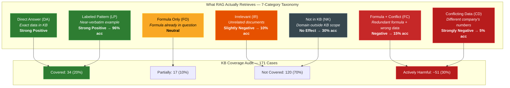
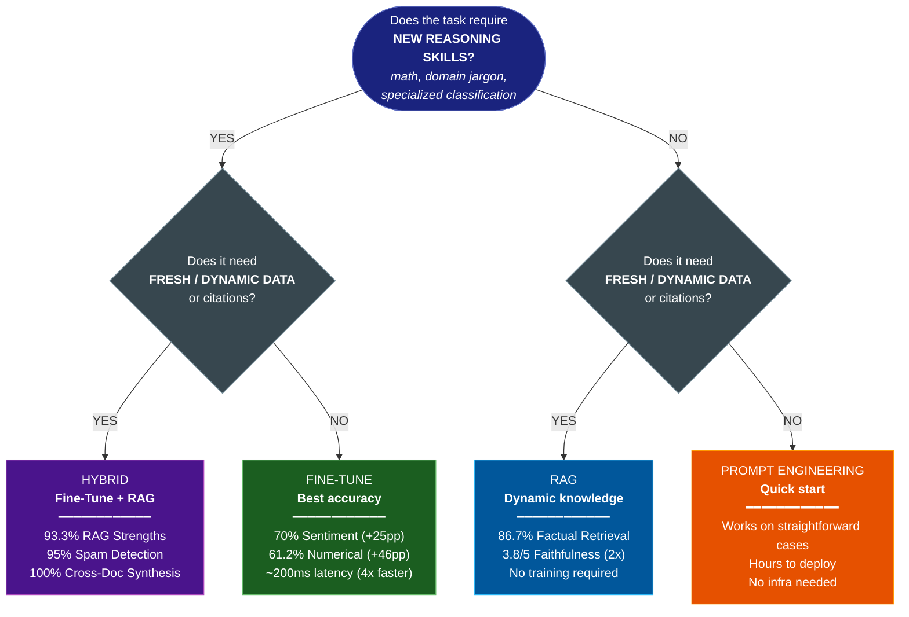
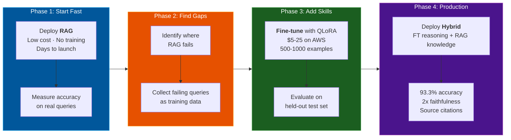

<p align="center">
  <h1 align="center">Fine-Tuning vs RAG: The Definitive Benchmark</h1>
  <p align="center">
    <strong>253 test cases. 7 models. 6 benchmarks. One question answered with data, not opinions.</strong>
  </p>
  <p align="center">
    <a href="#quick-start"></a>
    <a href="#the-results"></a>
    <a href="#llm-as-judge"></a>
    <a href="#papers"></a>
    <a href="LICENSE"></a>
  </p>
</p>

---

**Should you fine-tune or use RAG?** Everyone has an opinion. We have **253 measured experiments**.

This project runs **controlled, apples-to-apples benchmarks** across 4 tasks, 4 approaches, and 7 models -- all on the same hardware, same evaluation, full transparency. It ships as a one-click Docker app with an interactive Streamlit UI, a 39-slide presentation, and pre-computed results you can explore immediately.

```
Fine-tuning teaches SKILLS.  RAG provides KNOWLEDGE.
The best systems combine both.  We prove it.
```

## High-Level Architecture



## What makes this different

| | |
|---|---|
| **Same architecture** | Base vs fine-tuned use identical architectures -- only weights differ |
| **4-way comparison** | Every test case runs through Base, Fine-Tuned, RAG, and Hybrid |
| **253 test cases** | 6 benchmark suites: standard, adversarial, RAG strengths, model family |
| **LLM-as-Judge** | GPT-4o structured evaluation (correctness, reasoning, faithfulness) |
| **The Formula Trap** | We discovered why RAG appears to fail -- and proved it's the benchmark, not RAG |
| **Full presentations** | 39 web slides + 62-slide PowerPoint, auto-generated from benchmark data |
| **Real cost analysis** | Tokens, latency, and $/1K queries measured for every approach |

## The headline numbers

| Finding | Evidence |
|---------|----------|
| Fine-tuning teaches skills | FinBERT 70% vs base 45% on sentiment |
| RAG can't teach math | 15% &rarr; 15.3% on numerical reasoning |
| **But RAG wasn't broken** | **86.7%** when data aligns (vs 15% with conflicts) |
| Hybrid wins overall | 93.3% on RAG strengths, 75% on sentiment |
| RAG reduces hallucination | Faithfulness: 3.8/5 vs base 1.9/5 (GPT-4o judge) |
| Model size isn't everything | 66M DistilBERT matches ~8B GPT-4o-mini on spam |

## The Discovery: RAG Was Never Broken

Most benchmarks show RAG struggling on numerical tasks (~15% accuracy). We discovered **why** -- and it changes the conclusion:



| Benchmark | RAG Accuracy | What Happened |
|-----------|-------------|---------------|
| Standard numerical | **15.3%** | Retrieved data **conflicted** with test data |
| RAG Strengths | **86.7%** | Retrieved data **aligned** with the question |
| Delta | **+71.4pp** | Same model, same RAG pipeline, different data alignment |

This is the **Formula Trap**: the RAG knowledge base provides formulas the model already knows, plus data that contradicts what the test case needs. The problem was never RAG -- it was the benchmark design. Our RAG Strengths benchmark fixes this by testing RAG on its actual production use case: answering questions about proprietary documents.

> Full analysis: [`data/rag_formula_vs_answer_analysis.md`](data/rag_formula_vs_answer_analysis.md)

## The Results

### Benchmark Methodology



### 6 Benchmark Suites, 253 Test Cases

| Suite | Cases | What It Tests | Key Finding |
|-------|-------|---------------|-------------|
| **Standard** (4 experiments) | 53 | Sentiment, numerical, ratios, spam | Fine-tuning wins on skill tasks |
| **Adversarial** (4 experiments) | 120 | Noisy retrieval, knowledge conflict, OOD | All approaches degrade; fine-tuning most robust |
| **RAG Strengths** | 30 | Factual retrieval, cross-doc synthesis, trends | RAG 86.7%, Hybrid 93.3% |
| **Model Family** | 50 | DistilBERT 66M vs GPT-4o-mini ~8B | 121x smaller model matches on spam |

### Experiment 1: Sentiment Classification (BERT 110M)

| Approach | Accuracy | Confidence | Cost/1K |
|----------|---------|-----------|---------|
| Base BERT | 45% | 0.375 | $0.0002 |
| **FinBERT (fine-tuned)** | **70%** | **0.845** | $0.0002 |
| BERT + RAG | 65% | 0.564 | ~$0.001 |
| **FinBERT + RAG (hybrid)** | **75%** | 0.702 | ~$0.001 |

**Where each wins:** FinBERT dominates domain jargon (100% vs RAG 0%) because it *learned* that "headwinds" means negative. RAG dominates subtle neutral cases (100% vs FinBERT 40%) because retrieved examples provide signal.

### Experiment 2: Numerical Reasoning (Llama2 7B)

| Approach | Accuracy | Why |
|----------|---------|-----|
| Base Llama2 | ~15% | Can't do financial math |
| **FinQA-7B** | **61.2%** | Learned calculation patterns from 8,281 FinQA examples |
| Llama2 + RAG | 15.3% | Retrieval adds context, not computation ability |
| **FinQA-7B + RAG** | **65.8%** | Best of both |

### Experiment 5: RAG Strengths (Llama2 7B) -- NEW

*30 cases testing RAG on proprietary document retrieval, cross-document synthesis, and contextual interpretation.*

| Approach | Accuracy | Judge Score | Faithfulness |
|----------|---------|-------------|-------------|
| Base Llama2 | 43.3% | 1.92 / 5 | 1.9 / 5 |
| **Llama2 + RAG** | **86.7%** | **3.49 / 5** | **3.8 / 5** |
| FinQA-7B | 40.0% | 2.00 / 5 | 2.1 / 5 |
| **FinQA-7B + RAG (hybrid)** | **93.3%** | **3.64 / 5** | **3.8 / 5** |

**By category:**

| Category | Base | RAG | Fine-tuned | Hybrid |
|----------|------|-----|------------|--------|
| Direct Retrieval (8 cases) | 12.5% | 75.0% | 0.0% | **100%** |
| Formula + Aligned Data (6) | 16.7% | 83.3% | 33.3% | 66.7% |
| Cross-Document Synthesis (8) | 62.5% | 87.5% | 62.5% | **100%** |
| Contextual Interpretation (4) | 50.0% | **100%** | 25.0% | **100%** |
| Trend Analysis (4) | 100% | 100% | 100% | 100% |

> Direct retrieval shows the largest gap: base models literally cannot answer questions about documents they've never seen. This is RAG's fundamental value proposition.

### Adversarial Stress Test (120 cases)



**Key adversarial insight:** On tasks requiring reasoning skills (numerical, ratios), adding more context through RAG **degrades** performance. Hybrid scores the worst (1.86/5) on adversarial ratios — irrelevant context is worse than no context. But on classification tasks (sentiment, spam), fine-tuning and RAG provide complementary robustness.

### LLM-as-Judge

Every RAG Strengths test case is evaluated by GPT-4o on three dimensions:

- **Correctness** (1-5): Does the answer contain the right facts?
- **Reasoning Quality** (1-5): Does it show understanding?
- **Faithfulness** (1-5): Is it grounded in documents (not hallucinated)?

RAG models score **2x higher on faithfulness** (3.8 vs 1.9) than base models -- retrieved documents anchor responses in facts rather than hallucination.

```mermaid
xychart-beta
    title "LLM Judge Scores — RAG Strengths Benchmark (30 cases)"
    x-axis ["Correctness", "Reasoning", "Faithfulness", "Overall"]
    y-axis "Score (1-5)" 0 --> 5
    bar [1.50, 2.60, 1.93, 1.92]
    bar [3.43, 3.37, 3.80, 3.49]
    bar [1.57, 2.67, 2.07, 2.00]
    bar [3.57, 3.43, 3.67, 3.64]
```



*Bars: Base | RAG | Fine-tuned | Hybrid — RAG's faithfulness (3.80) is the highest single score; Hybrid leads overall (3.64)*

## Quick Start

### Docker (recommended)

```bash
git clone https://github.com/intelliswarm-ai/finetune-vs-rag.git
cd finetune-vs-rag
cp .env.example .env          # Add OPENAI_API_KEY for LLM-as-Judge (optional)
docker compose up --build
# Open http://localhost:8501
```

First run takes ~10 minutes (downloads 7B models, builds FinQA-7B via LoRA merge, indexes documents, pre-computes all benchmarks). After that, starts in seconds.

**What Docker does automatically:**
- Pulls Llama2-7B and creates FinQA-7B (LoRA adapter merge) via Ollama
- Downloads FinBERT, bert-base-uncased, DistilBERT, and sentence-transformers
- Initializes ChromaDB with 12 financial documents (24 chunks)
- Pre-computes all 6 benchmark suites (253 test cases)
- Starts the Streamlit app on port 8501

### macOS / Linux (native)

```bash
brew install ollama python       # macOS, or your package manager
cp .env.example .env
./run-macos.sh
# Open http://localhost:8501
```

Requires ~8GB RAM for 7B model inference.

## What's Inside

### Interactive Presentation (39 web slides + 62 PowerPoint slides)

A complete educational deck covering:
- LLM fundamentals and the specialization challenge
- RAG mechanics: embeddings, vector stores, retrieval pipelines
- Fine-tuning methods: full fine-tuning, LoRA, QLoRA
- Head-to-head comparison with decision framework
- Tools landscape: training platforms, RAG infrastructure
- All 6 benchmark suites with charts and analysis
- RAG Strengths findings and the Formula Trap discovery
- LLM-as-Judge quality assessment with radar charts
- Conclusions with actionable decision framework

The PowerPoint is auto-generated from benchmark data (`python generate_pptx.py`) with speaker notes for every slide.

### Live Demos (4 experiments)

Each experiment has a demo page and a live query page:

- **Sentiment Analysis** -- Type financial text, see FinBERT vs base BERT vs RAG vs Hybrid classify it in real time with confidence scores
- **Numerical Reasoning** -- Enter financial questions with data tables, watch all 4 approaches attempt calculations with step-by-step streaming
- **Financial Ratios** -- Complex multi-step ratio computations (DuPont ROE, CAGR, leverage)
- **Spam Detection** -- Fine-tuned DistilBERT vs base vs RAG on phishing/spam emails

### 6 Benchmark Dashboards

| Dashboard | Cases | Features |
|-----------|-------|----------|
| Standard Results | 53 | Accuracy, latency, F1, cost, category breakdown |
| Adversarial Stress Test | 120 | Noisy retrieval, knowledge conflict, OOD |
| RAG Strengths | 30 | Factual retrieval, cross-doc synthesis, LLM judge |
| Model Family | 50 | DistilBERT 66M vs GPT-4o-mini ~8B |
| How It Works | -- | Architecture diagrams, RAG pipeline |
| Presentation | 39 | Slides with Mermaid diagrams, charts |

Every dashboard supports both **live execution** (run in the UI with progress bars) and **pre-computed results** (instant loading when models are offline).

## Architecture

```
finetune-vs-rag/
├── app/
│   ├── finetune_vs_rag.py              # Landing page
│   ├── demo_utils.py                   # All model inference (7 models, 4 approaches)
│   ├── rag_engine.py                   # ChromaDB + sentence-transformers pipeline
│   ├── benchmark.py                    # Standard benchmark runner
│   ├── adversarial_benchmark.py        # Adversarial stress test runner
│   ├── rag_strengths_benchmark.py      # RAG strengths benchmark runner
│   ├── llm_judge.py                    # GPT-4o structured evaluation
│   ├── model_family_benchmark.py       # Model size comparison runner
│   └── pages/                          # 14 Streamlit pages
├── src/
│   ├── rag/                            # Embeddings, vector store, RAG pipeline
│   ├── models/                         # Model wrappers (FinBERT, FinQA, hybrid)
│   └── evaluation/                     # Metrics (F1, MAPE) + model comparator
├── data/
│   ├── documents/                      # 12 financial docs for RAG (~27KB)
│   ├── benchmark_test_cases.json       # Standard test cases (53)
│   ├── adversarial_test_cases.json     # Adversarial cases (120)
│   ├── rag_strengths_benchmark.json    # RAG strengths cases (30)
│   ├── benchmark_results.json          # Pre-computed standard results
│   ├── adversarial_results.json        # Pre-computed adversarial results
│   ├── rag_strengths_results.json      # Pre-computed RAG strengths results
│   ├── rag_formula_vs_answer_analysis.md   # Formula Trap analysis
│   └── rag_coverage_analysis.md        # RAG KB coverage audit
├── papers/                             # 10 academic papers on FT vs RAG
├── generate_pptx.py                    # PowerPoint generator (62 slides)
├── Dockerfile                          # Multi-stage build with model pre-download
├── docker-compose.yml                  # Ollama + Streamlit orchestration
└── docker-entrypoint.sh                # Automated model setup + benchmark pre-computation
```

### Models

| Model | Params | Role | Source |
|-------|--------|------|--------|
| FinBERT | 110M | Fine-tuned financial sentiment | `ProsusAI/finbert` |
| bert-base-uncased | 110M | Base sentiment (same arch) | HuggingFace |
| FinQA-7B | 7B | Fine-tuned numerical reasoning (LoRA) | `truocpham/FinQA-7B-Instruct-v0.1` |
| llama2 | 7B | Base LLM | Ollama |
| DistilBERT (fine-tuned) | 66M | Spam/phishing classifier | Custom checkpoint |
| distilbert-base-uncased | 66M | Base spam (same arch) | HuggingFace |
| all-MiniLM-L6-v2 | 22M | RAG embeddings (384-dim) | sentence-transformers |

### RAG Pipeline



| Component | Implementation |
|-----------|---------------|
| Embedder | all-MiniLM-L6-v2 (384-dim, cosine similarity) |
| Vector Store | ChromaDB (in-memory, 24 chunks indexed) |
| Documents | 12 financial docs about Meridian National Bancorp |
| Chunking | 300-word chunks, 50-word overlap |
| Retrieval | Top-3 by cosine similarity with source attribution |
| Hybrid Blend | 60% fine-tuned scores + 40% RAG scores (classification) |

### The Fine-Tuning Is Real

FinQA-7B is **not llama2 with a better prompt**. It's llama2 with a LoRA adapter (rank 64, alpha 16) trained on 8,281 financial Q&A pairs from the FinQA dataset. The adapter modifies the `q_proj` and `v_proj` attention matrices -- actual weight changes. Ollama merges the adapter at model creation time.

FinBERT is bert-base-uncased fine-tuned on 50,000+ Financial PhraseBank sentences. Same 110M parameters, different weights.

## Key Takeaways

### The Fundamental Asymmetry: Knowledge vs Skill



### 1. Fine-tuning teaches skills, RAG provides knowledge

FinBERT *knows* "headwinds" is negative -- it learned this from training data. RAG can only find similar examples and guess. But RAG *knows* Meridian's CET1 ratio is 13.2% -- it retrieved the document. Fine-tuning can't access documents it was never trained on.

### 2. The data alignment problem explains most RAG failures

When RAG retrieves data that conflicts with the test case, it **hurts** performance (-71pp). When retrieved data aligns with the question, RAG **dominates** (+43pp over base). Most published benchmarks inadvertently create conflict scenarios.



### 3. RAG reduces hallucination

GPT-4o judge scores show RAG models achieve **2x higher faithfulness** (3.8/5 vs 1.9/5). Retrieved documents anchor responses in facts. This is RAG's most important production value.

### 4. Hybrid wins when you need both skills and knowledge

Hybrid (FinQA-7B + RAG) achieves 93.3% on RAG strengths -- combining fine-tuning's reasoning with RAG's factual grounding for the best results across every category.

### 5. Model size isn't everything

A 66M-parameter DistilBERT fine-tuned on task-specific data matches ~8B GPT-4o-mini on spam detection. The 121x parameter difference doesn't translate to better accuracy for focused classification tasks.

### 6. The decision framework



| Choose | When | Evidence |
|--------|------|----------|
| **Fine-Tuning** | Domain skills: math, classification, jargon interpretation | FinBERT 100% on jargon vs RAG 0% |
| **RAG** | Proprietary documents, dynamic data, citation needed | RAG 86.7% on factual retrieval |
| **Hybrid** | Maximum accuracy on complex tasks requiring both | Hybrid 93.3% vs next-best 86.7% |
| **Prompt Engineering** | Quick start, simple tasks, no training data | Base models work on straightforward cases |

### Practical Workflow: From Prototype to Production



## Papers

This project's methodology is informed by 10 academic papers:

| Paper | Venue | Key Contribution |
|-------|-------|-----------------|
| Fine-Tuning or Retrieval? Comparing Knowledge Injection in LLMs | EMNLP 2024 | RAG outperforms unsupervised FT for knowledge injection |
| Should We Fine-Tune or RAG? Evaluating Techniques for Dialogue | INLG 2024 | No universal best -- depends on task type |
| Fine Tuning LLMs for Enterprise: Practical Guidelines | 2024 | QLoRA guidelines, data prep recipes |
| DSL Code Generation: Fine-Tuning vs Optimized RAG | Microsoft 2024 | Optimized RAG matches FT quality |
| Finetune-RAG: Resist Hallucination in RAG | 2025 | 21.2% accuracy gain with hallucination-resistant FT |
| Fine-Tuning with RAG for Improving LLM Learning | ICLR 2026 | RAG-to-FT distillation: 10-60% fewer tokens |
| Domain-Driven LLM Development | KDD 2024 | Cost/ROI analysis for RAG vs FT |
| FT vs RAG for Less Popular Knowledge | SIGIR-AP 2024 | RAG dominates for long-tail knowledge |
| RAG vs Fine-Tuning vs Prompt Engineering | IJCTEC 2025 | Three-way comparison with prompt engineering |
| Fine-tuning LLM using RLHF | KTH 2023 | RLHF for domain specialization |

See [`state-of-the-art.md`](state-of-the-art.md) for the full roadmap with paper-backed improvements across 3 phases.

## Tech Stack

| Layer | Technology |
|-------|-----------|
| Frontend | Streamlit (14 pages) |
| LLM Serving | Ollama (OpenAI-compatible API) |
| Vector DB | ChromaDB |
| Embeddings | sentence-transformers (all-MiniLM-L6-v2) |
| ML Framework | PyTorch, HuggingFace Transformers, PEFT |
| Evaluation | GPT-4o LLM-as-Judge, scikit-learn, NLTK |
| Visualization | Plotly |
| Presentation | python-pptx (auto-generated), Mermaid diagrams |
| Infrastructure | Docker, Docker Compose |

## Contributing

Contributions are welcome. See [`state-of-the-art.md`](state-of-the-art.md) for the improvement roadmap with specific tasks.

Areas where help is especially valuable:
- Additional benchmark domains beyond finance
- GPU-accelerated inference benchmarks
- Multi-language RAG evaluation
- Alternative embedding models comparison
- Fine-tuning with more recent base models (Llama3, Mistral)

## License

MIT License
